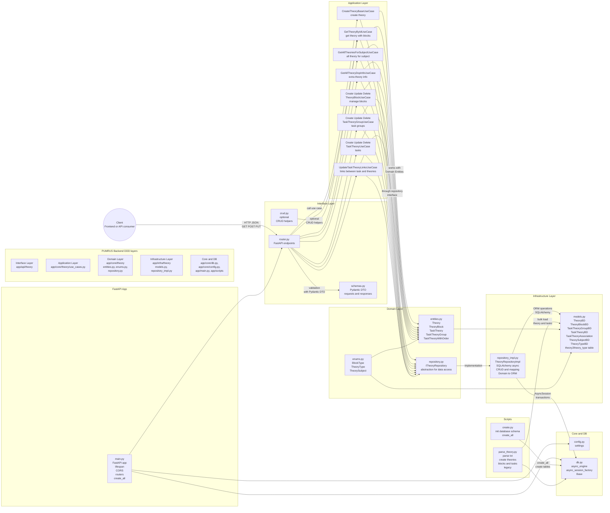

```mermaid
flowchart LR
    %% ========== LEGEND ==========
    subgraph Legend["PUMRUS Backend DDD layers"]
        L1[Interface Layer\napp/api/theory]
        L2[Application Layer\napp/core/theory/use_cases.py]
        L3[Domain Layer\napp/core/theory\nentities.py, enums.py,\nrepository.py]
        L4[Infrastructure Layer\napp/infra/theory\nmodels.py, repository_impl.py]
        L5[Core and DB\napp/core/db.py,\napp/core/config.py,\napp/main.py, app/scripts]
    end

    %% ========== INTERFACE LAYER ==========
    subgraph InterfaceLayer["Interface Layer"]
        R[router.py\nFastAPI endpoints]
        S[schemas.py\nPydantic DTO\nrequests and responses]
        C[crud.py\noptional\nCRUD helpers]
    end

    %% ========== DOMAIN LAYER ==========
    subgraph DomainLayer["Domain Layer"]
        E[entities.py\nTheory\nTheoryBlock\nTaskTheory\nTaskTheoryGroup\nTaskTheoryWithOrder]
        EN[enums.py\nBlockType\nTheoryType\nTheorySubject]
        RI[repository.py\nITheoryRepository\nabstraction for data access]
    end

    %% ========== APPLICATION LAYER ==========
    subgraph ApplicationLayer["Application Layer"]
        UC_CreateTheory[CreateTheoryBaseUseCase\ncreate theory]
        UC_GetTheory[GetTheoryByIdUseCase\nget theory with blocks]
        UC_AllTheory[GetAllTheoriesForSubjectUseCase\nall theory for subject]
        UC_AllDop[GetAllTheoryDopInfoUseCase\nextra theory info]

        UC_Block[Create Update Delete\nTheoryBlockUseCase\nmanage blocks]
        UC_TaskGroup[Create Update Delete\nTaskTheoryGroupUseCase\ntask groups]
        UC_Task[Create Update Delete\nTaskTheoryUseCase\ntasks]
        UC_Links[UpdateTaskTheoryLinksUseCase\nlinks between task and theories]
    end

    %% ========== INFRASTRUCTURE LAYER ==========
    subgraph InfraLayer["Infrastructure Layer"]
        M[models.py\nTheoryBD\nTheoryBlockBD\nTaskTheoryGroupBD\nTaskTheoryBD\nTaskTheoryAssociation\nTheorySubjectBD\nTheoryTypeBD\ntheory2theory_type table]
        RImpl[repository_impl.py\nTheoryRepositoryImpl\nSQLAlchemy async\nCRUD and mapping\nDomain to ORM]
    end

    %% ========== CORE / DB / MAIN / SCRIPTS ==========
    subgraph CoreLayer["Core and DB"]
        CFG[config.py\nsettings]
        DB[db.py\nasync_engine\nasync_session_factory\nBase]
    end

    subgraph AppLayer["FastAPI App"]
        MAIN[main.py\nFastAPI app\nlifespan\nCORS\nrouters\ncreate_all]
    end

    subgraph ScriptsLayer["Scripts"]
        CR[create.py\ninit database schema\ncreate_all]
        PT[parse_theory.py\nparse txt\ncreate theories\nblocks and tasks\nlegacy]
    end

    %% ========== REQUEST FLOW ==========
    Client(("Client\nFrontend or API consumer")) -->|HTTP JSON\nGET POST PUT| R

    %% Interface → Application
    R -->|validation\nwith Pydantic DTO| S
    R -->|call use case| UC_CreateTheory
    R --> UC_GetTheory
    R --> UC_AllTheory
    R --> UC_AllDop
    R --> UC_Block
    R --> UC_TaskGroup
    R --> UC_Task
    R --> UC_Links
    C -->|optional\nCRUD helpers| UC_GetTheory

    %% Application → Domain
    UC_CreateTheory -->|works with\nDomain Entities| E
    UC_GetTheory --> E
    UC_AllTheory --> E
    UC_AllDop --> E
    UC_Block --> E
    UC_TaskGroup --> E
    UC_Task --> E
    UC_Links --> E
    EN --> E

    %% Application → Repository
    UC_CreateTheory -->|through repository\ninterface| RI
    UC_GetTheory --> RI
    UC_AllTheory --> RI
    UC_AllDop --> RI
    UC_Block --> RI
    UC_TaskGroup --> RI
    UC_Task --> RI
    UC_Links --> RI

    %% Repository → Infrastructure
    RI -->|implementation| RImpl
    RImpl -->|ORM operations\nSQLAlchemy| M
    RImpl -->|AsyncSession\ntransactions| DB

    %% Core / Main / Scripts
    MAIN --> R
    MAIN --> CFG
    MAIN --> DB

    CR -->|create_all\ncreate tables| DB
    PT -->|bulk load\ntheory and tasks| M
    PT --> DB

    %% Domain ↔ Persistence mapping (simplified for GitHub)
    E --> M
    EN --> M
```
